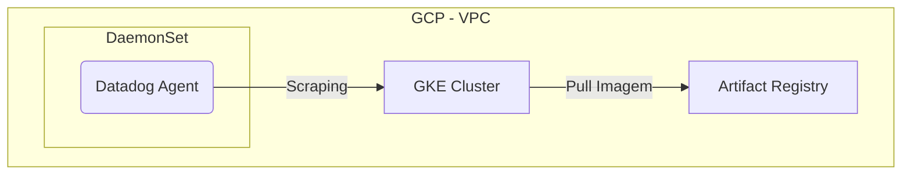

# Oficina Mecânica - Infraestrutura GKE e Rede

## Propósito
Este repositório provisiona a camada de orquestração de containers da aplicação e as integrações fundamentais com ferramentas de monitoramento.

## Tecnologias Utilizadas
- **Terraform** (Provider do GCP e Helm)
- **Google Kubernetes Engine (GKE)**
- **Artifact Registry**
- **Datadog Agent**

## Passos para Execução e Deploy

**Execução e Deploy:**
A infraestrutura é provisionada automaticamente pelo GitHub Actions a cada commit na `main` ou `homolog`.
Se precisar rodar localmente:
1. `gcloud auth application-default login`
2. `terraform init`
3. `terraform workspace select main`
4. `terraform apply -var-file=environments/main.tfvars`

## Diagrama de Arquitetura

## APIs e Documentação
**Não aplicável.** Este é um repositório puramente de Infraestrutura (Terraform), não expondo interfaces HTTP.
